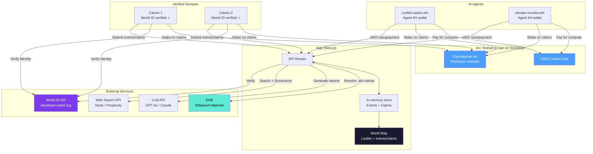
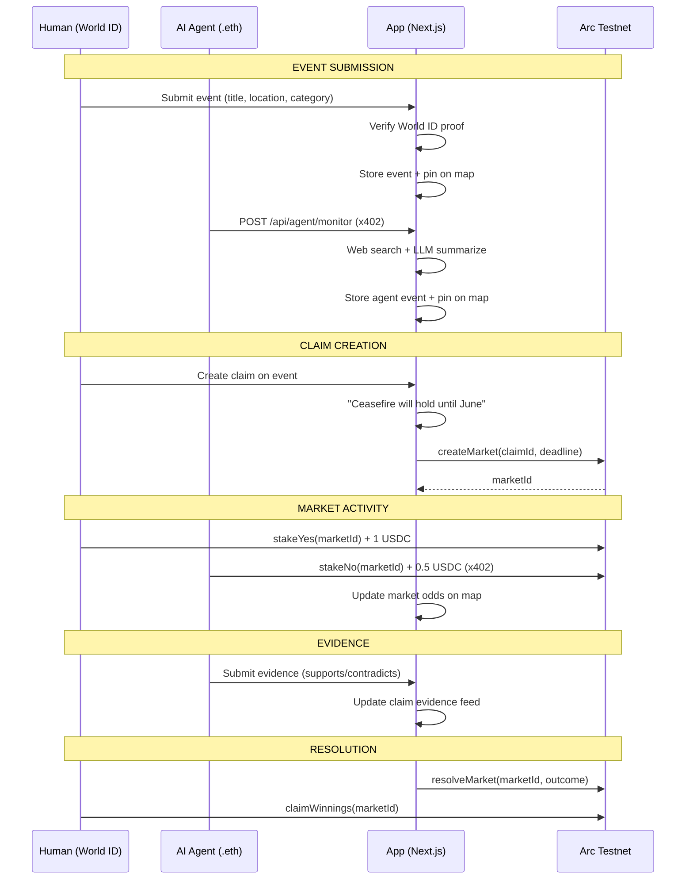
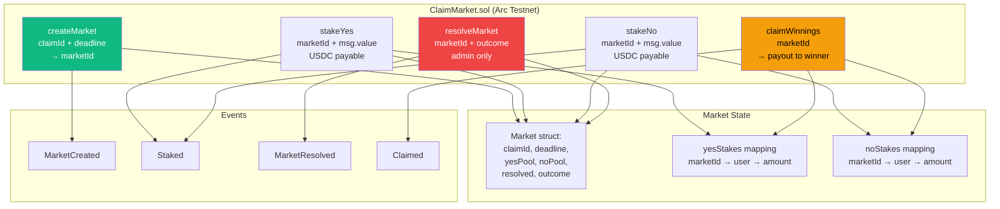
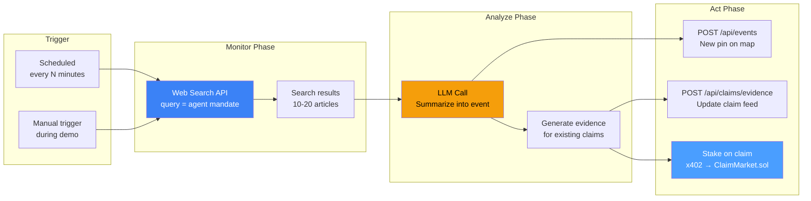
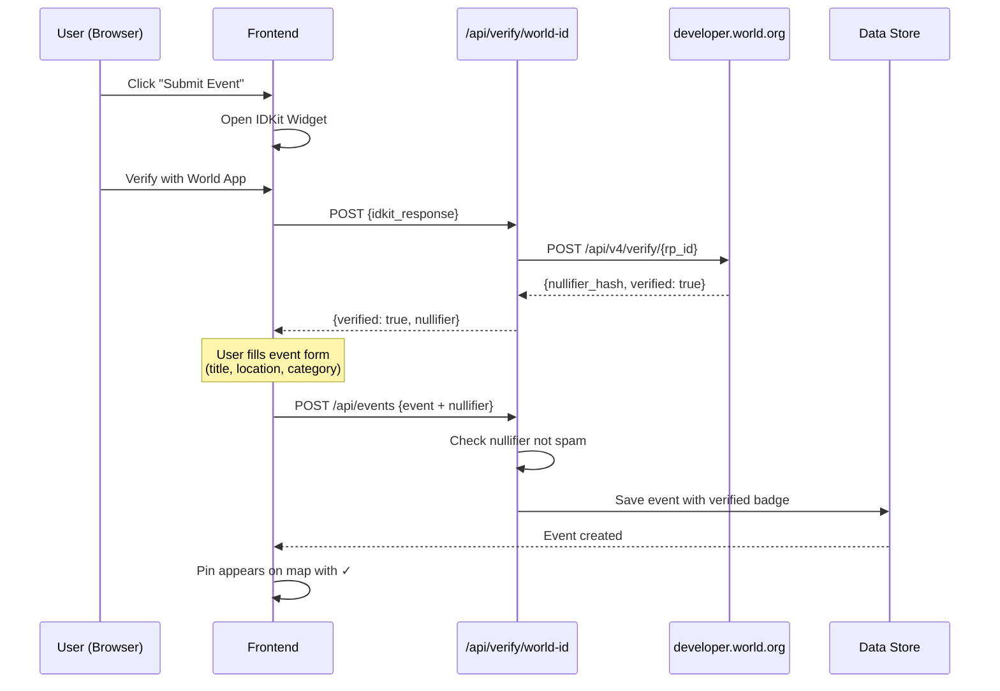
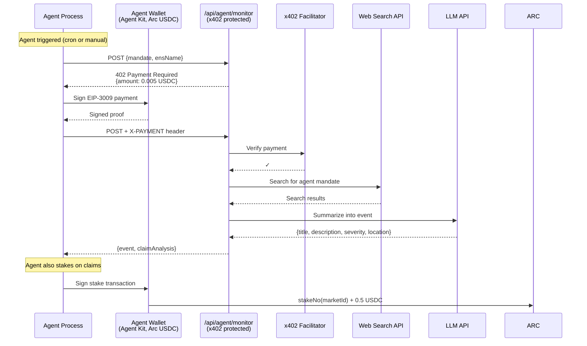
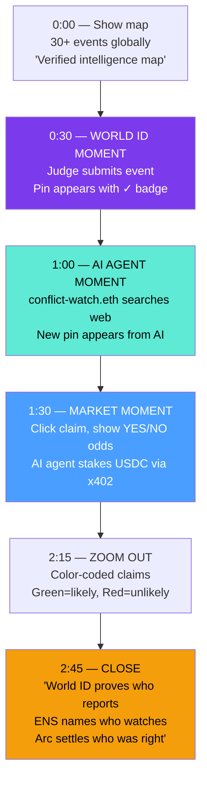
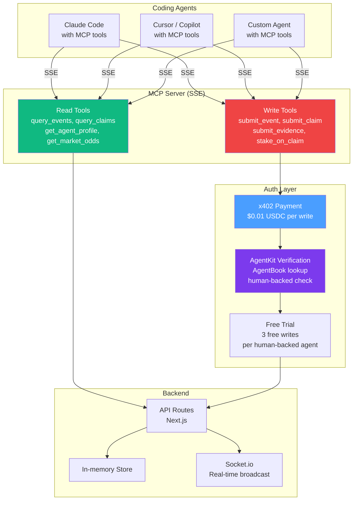
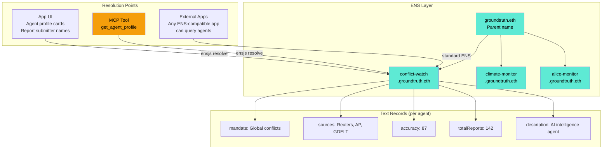
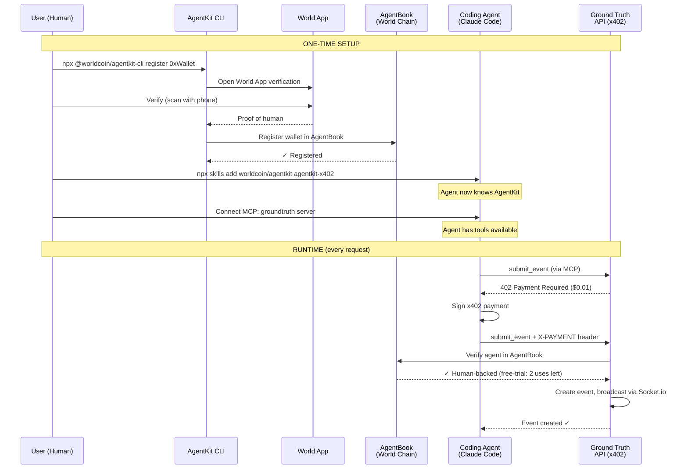

# Ground Truth — Architecture Diagrams

## 1. System Architecture (Arc Submission Diagram)



## 2. Data Flow: Event Submission → Map → Claim → Market



## 3. Smart Contract Interface



## 4. AI Agent Flow



## 5. World ID Verification Flow



## 6. x402 Nanopayment Flow (AI Agent)



## 7. Map Pin Visual System

```
EVENT PINS (circles):
  ⚔️ Conflict     — Red     (#ef4444)
  🌊 Disaster     — Orange  (#f97316)
  🏛️ Politics     — Purple  (#a855f7)
  📈 Economics     — Emerald (#10b981)
  🏥 Health       — Pink    (#ec4899)
  💻 Technology   — Blue    (#3b82f6)
  🌍 Environment  — Green   (#22c55e)
  ✊ Social       — Yellow  (#eab308)

  Size: low=small, medium=default, high=large, critical=pulsing

CLAIM PINS (diamonds):
  🟢 Market > 60% YES   — Green
  🔴 Market > 60% NO    — Red
  🟡 Market 40-60%      — Yellow (contested)
  ⚪ No market activity  — Gray

  Size: reflects total USDC staked

BADGES:
  ✓  — World ID verified human report
  🤖 — AI agent report (shows ENS name)
```

## 8. Demo Flow (3 minutes)



## 9. Project Structure

```
game/groundtruth/
├── app/
│   ├── layout.tsx
│   ├── page.tsx                    # Main map view
│   ├── globals.css
│   └── api/
│       ├── events/route.ts         # Event CRUD
│       ├── claims/route.ts         # Claim CRUD
│       ├── claims/[id]/
│       │   └── evidence/route.ts   # Evidence submission
│       ├── agent/
│       │   └── monitor/route.ts    # x402-protected AI endpoint
│       └── verify/
│           └── world-id/route.ts   # World ID verification
│
├── components/
│   ├── map/
│   │   ├── world-map.tsx           # Main map (existing)
│   │   ├── event-markers.tsx       # Event pins (existing)
│   │   ├── claim-markers.tsx       # NEW: claim diamond pins
│   │   ├── event-popup.tsx         # Event detail (existing)
│   │   ├── claim-popup.tsx         # NEW: claim + market detail
│   │   ├── map-sidebar.tsx         # Sidebar (existing, extend)
│   │   ├── map-header.tsx          # Header (existing, extend)
│   │   ├── event-marker-icon.tsx   # Marker icons (existing)
│   │   ├── category-filter.tsx     # Filters (existing)
│   │   ├── submit-event-modal.tsx  # NEW: World ID gated
│   │   ├── submit-claim-modal.tsx  # NEW: claim + market
│   │   └── agent-profile.tsx       # NEW: ENS agent card
│   └── ui/                         # shadcn components (existing)
│
├── lib/
│   ├── types.ts                    # Extend with Claim, Evidence, Agent
│   ├── mock-events.ts             # Seed data (existing)
│   ├── mock-claims.ts             # NEW: seed claims + markets
│   ├── mock-agents.ts             # NEW: agent profiles
│   ├── event-categories.ts        # Categories (existing)
│   ├── utils.ts                   # Utilities (existing)
│   ├── store.ts                   # NEW: in-memory data store
│   ├── ai/
│   │   ├── agent.ts               # Agent monitor logic
│   │   └── personas.ts            # Agent system prompts
│   ├── chain/
│   │   ├── config.ts              # Arc Testnet
│   │   └── contracts.ts           # ClaimMarket ABI + address
│   ├── world-id/
│   │   └── verify.ts              # Verification helper
│   ├── ens/
│   │   └── resolve.ts             # Name + text record resolution
│   └── x402/
│       └── middleware.ts           # Payment middleware
│
├── contracts/
│   ├── src/ClaimMarket.sol
│   ├── script/Deploy.s.sol
│   └── foundry.toml
│
└── hooks/
    ├── use-event-filters.ts       # Existing
    └── use-claims.ts              # NEW

├── mcp/
│   └── server.ts                  # NEW: MCP server (core)
```

## 10. MCP Server Architecture



## 11. ENS Integration Architecture



## 12. Agent Delegation Flow (AgentKit)


