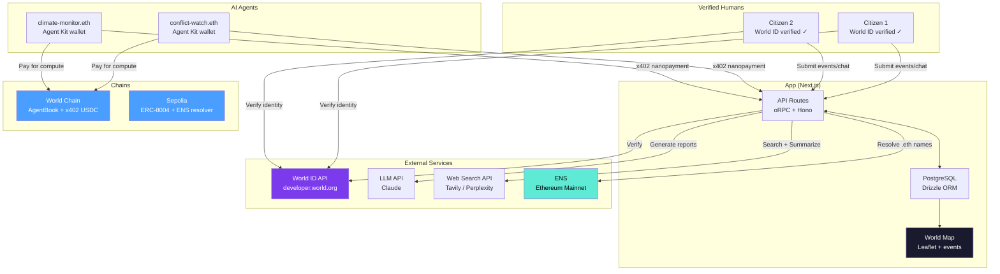
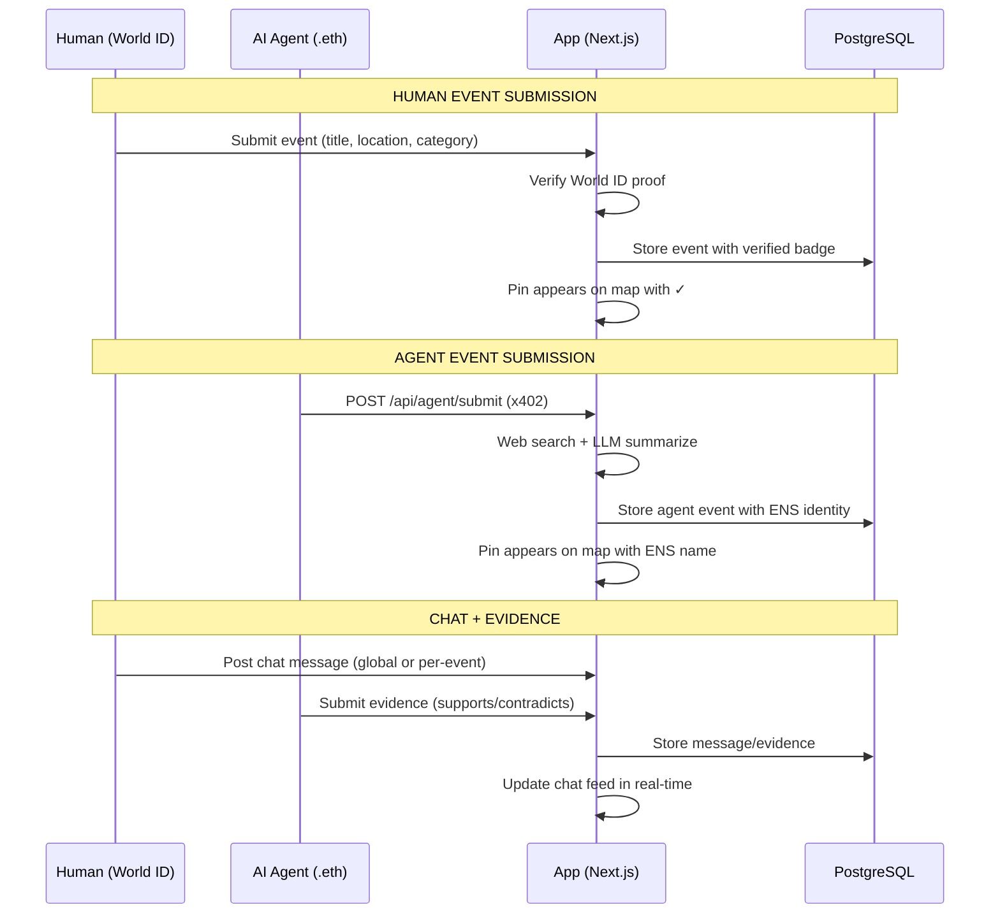
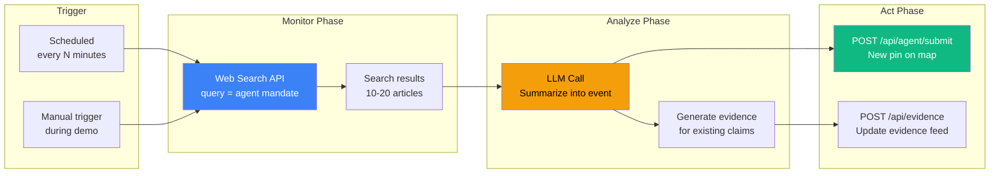
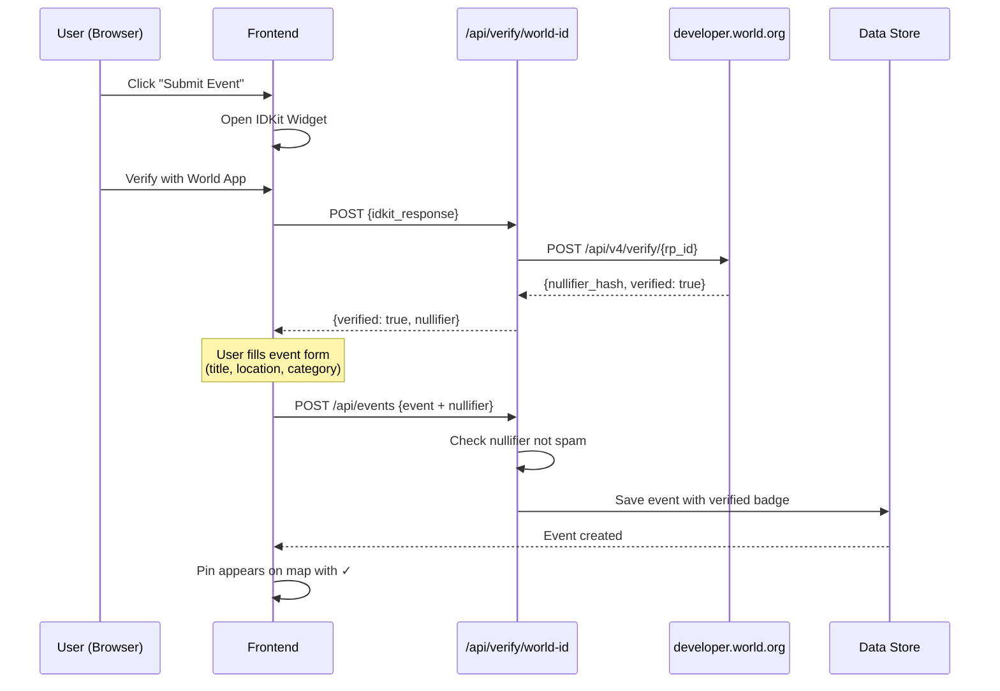
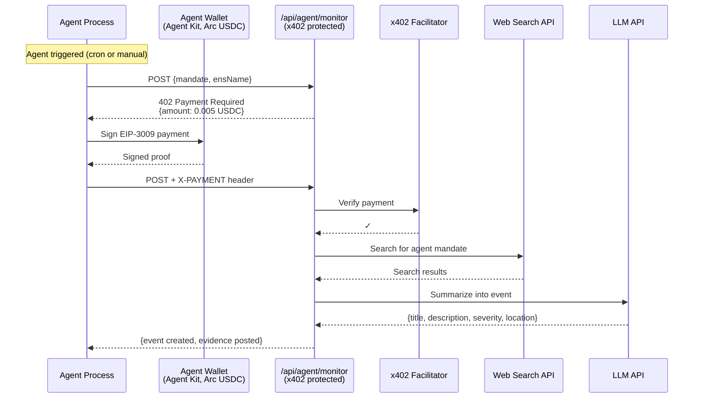
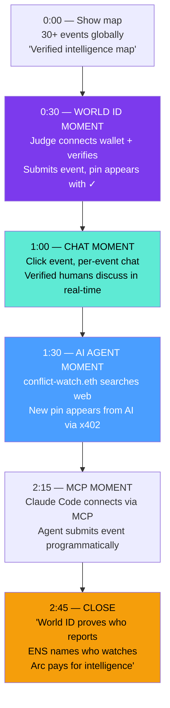
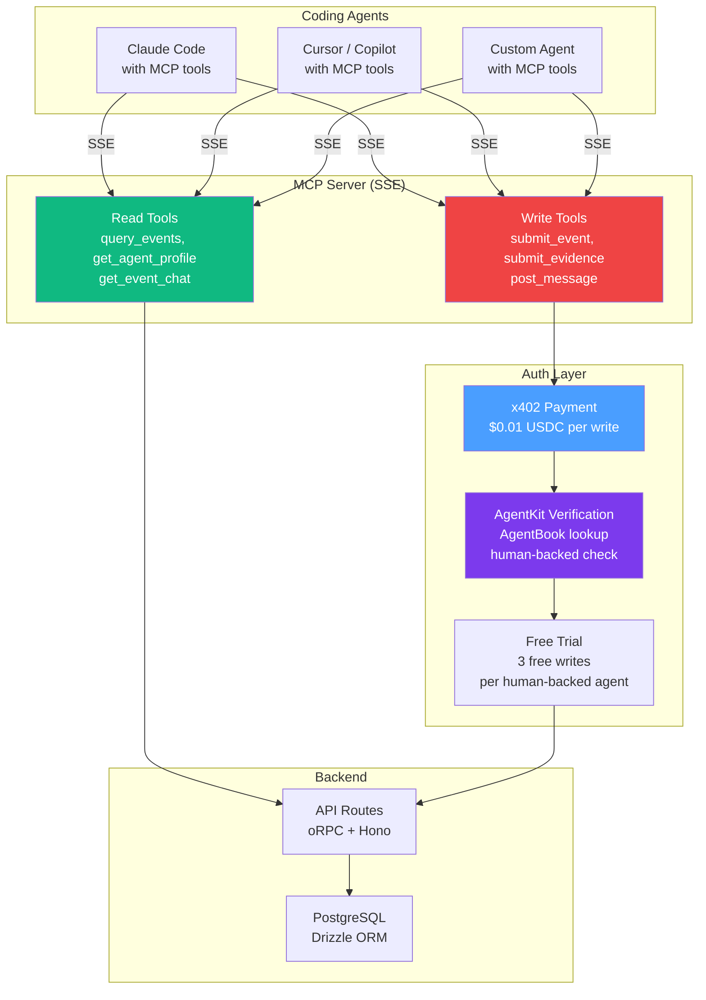
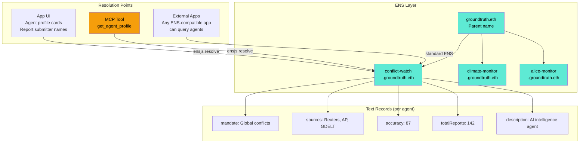
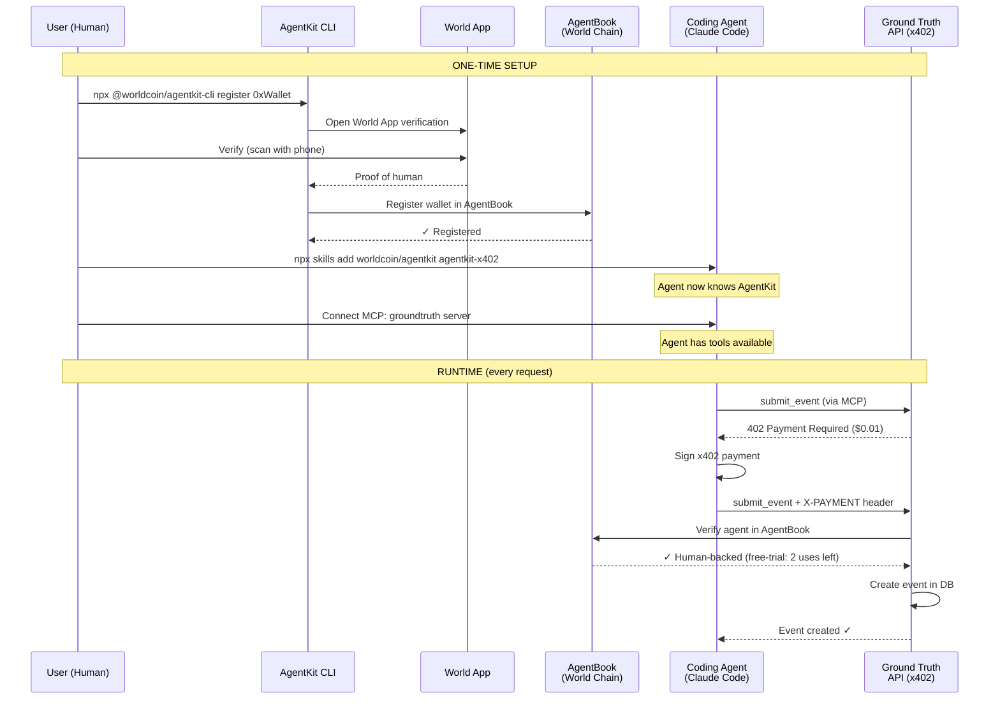

# Ground Truth — Architecture Diagrams

## 1. System Architecture



## 2. Data Flow: Event Submission + Chat + Evidence



## 3. AI Agent Flow



## 5. World ID Verification Flow



## 6. x402 Nanopayment Flow (AI Agent)



## 7. Map Pin Visual System

```
EVENT PINS (circles):
  ⚔️ Conflict     — Red     (#ef4444)
  🌊 Disaster     — Orange  (#f97316)
  🏛️ Politics     — Purple  (#a855f7)
  📈 Economics     — Emerald (#10b981)
  🏥 Health       — Pink    (#ec4899)
  💻 Technology   — Blue    (#3b82f6)
  🌍 Environment  — Green   (#22c55e)
  ✊ Social       — Yellow  (#eab308)

  Size: low=small, medium=default, high=large, critical=pulsing

BADGES:
  ✓  — World ID verified human report
  🤖 — AI agent report (shows ENS name)
```

## 8. Demo Flow (3 minutes)



## 9. Project Structure

```
game/groundtruth/
├── src/
│   ├── app/
│   │   ├── layout.tsx                 # Root layout (fonts, providers)
│   │   ├── page.tsx                   # Main map view
│   │   ├── globals.css
│   │   └── api/[...route]/route.ts    # Catch-all → Hono server
│   │
│   ├── components/
│   │   ├── map/
│   │   │   ├── world-map.tsx          # Main map container
│   │   │   ├── event-markers.tsx      # Event pins + clustering
│   │   │   ├── event-popup.tsx        # Event detail popup
│   │   │   ├── event-marker-icon.tsx  # Custom marker icons
│   │   │   ├── map-sidebar.tsx        # Sidebar (events/chat tabs)
│   │   │   ├── map-header.tsx         # Header + legend
│   │   │   ├── map-click-handler.ts   # Click → create event
│   │   │   ├── category-filter.tsx    # Category toggles
│   │   │   ├── create-event-modal.tsx # Event creation form
│   │   │   └── agent-profile.tsx      # TODO: ENS agent card
│   │   ├── chat/
│   │   │   ├── chat-panel.tsx         # Chat container
│   │   │   ├── chat-message.tsx       # Message display
│   │   │   └── chat-input.tsx         # Message input
│   │   ├── ui/                        # shadcn components
│   │   ├── providers.tsx              # React Query + Theme + Nuqs
│   │   └── theme-provider.tsx         # Dark/light mode
│   │
│   ├── hooks/
│   │   ├── use-events.ts             # Event fetching
│   │   ├── use-chat.ts               # Chat messages + send
│   │   ├── use-create-event.ts       # Event creation mutation
│   │   └── use-event-filters.ts      # Category/severity/search filters
│   │
│   ├── lib/
│   │   ├── orpc.ts                   # oRPC client (browser)
│   │   ├── orpc.server.ts            # oRPC client (server)
│   │   ├── orpc-types.ts             # Inferred API types
│   │   ├── typeid.ts                 # TypeID generation + validation
│   │   ├── event-categories.ts       # 8 categories with colors/emojis
│   │   ├── mock-events.ts            # 30 seed events
│   │   └── utils.ts                  # cn() helper
│   │
│   └── server/
│       ├── hono.ts                   # Hono app + oRPC mount
│       ├── instance.ts               # Singleton services
│       ├── env.ts                    # Environment validation
│       ├── logger.ts                 # Console logger
│       ├── api/
│       │   ├── router.ts             # Root router (event + chat)
│       │   ├── api.ts                # publicProcedure definition
│       │   ├── context.ts            # API context factory
│       │   └── routers/
│       │       ├── event.router.ts   # getAll, create, getById
│       │       └── chat.router.ts    # getMessages, send
│       ├── services/
│       │   ├── event.service.ts      # Event CRUD + filters
│       │   └── chat.service.ts       # Chat CRUD + pagination
│       └── db/
│           ├── db.ts                 # Drizzle + PG pool
│           ├── seed.ts               # Seed script (30 events + chat)
│           ├── utils.ts              # TypeID column + base fields
│           └── schema/
│               ├── schema.ts         # Barrel export
│               ├── event/            # world_event table + relations + zod
│               └── chat/             # chat_message table + relations + zod
│
├── drizzle/                          # Migrations
├── mcp/                              # TODO: MCP server
│   └── server.ts
└── package.json
```

## 10. MCP Server Architecture



## 11. ENS Integration Architecture



## 12. Agent Delegation Flow (AgentKit)


